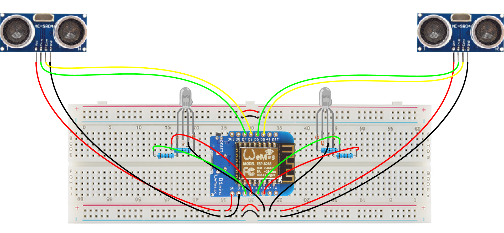

# ParkingSensor

A simple, proof of concept, car-parking sensor that will tell you when you're too close to the wall (or other obstacles). This project has it's origins [here](https://gathering.tweakers.net/forum/list_messages/1967946) (Dutch). The schema is a bit messy; I currently don't have a decent circuit editor... Sorry 'bout that!

With a little effort this circuit can be extended with another HC SR-04 sensor and LED, but I'll leave that up to the reader.

## Bill of Materials

You'll need:

* 2x [HC SR-04](https://www.aliexpress.com/item/32703532280.html)
* 2x [RGB LED](https://www.aliexpress.com/item/32271669442.html) (or [2x red LED and 2x green LED](https://www.aliexpress.com/item/32892747183.html)
* 4x [220Ω resistor](https://www.aliexpress.com/item/32816049069.html)
* 1x [Wemos D1 mini](https://www.aliexpress.com/item/32863218532.html)
* 1x [Breadboard](https://www.aliexpress.com/item/32256273855.html)
* [Some wires](https://www.aliexpress.com/item/32909050779.html)
* [USB cable](https://www.aliexpress.com/item/32720252498.html) to program the D1 mini or a [3.3V/5.0V power supply](https://www.aliexpress.com/item/1951850466.html) once programmed

Recommended:

* [Multimeter](https://www.aliexpress.com/item/33004463675.html) for troubleshooting
* [Project box](https://www.aliexpress.com/item/32889586884.html)

## Demo

Click the image below to play the video

